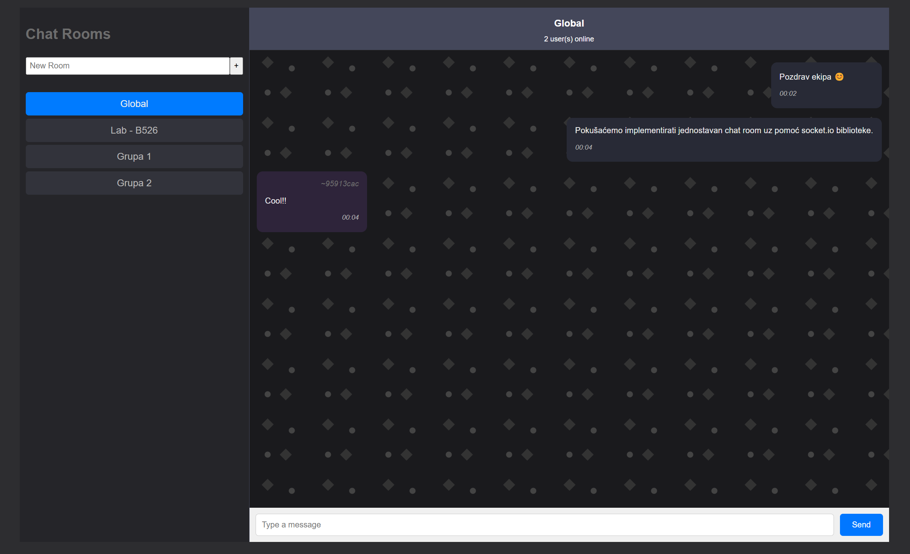

# NWT - Chat Room Application with Socket.io

This project provides a fully implemented server and frontend for a chat room application. Students will also have access to [resources](https://fesb-nwt.netlify.app/docs/Sockets/Kreiranje%20Strukture/) for the frontend, which is nearly complete but includes a few additional tasks for completion.

<br></br>

---

## Getting Started

### 1. Clone the Repository

Ensure you have cloned the project repository to your local machine.

### 2. Start the Frontend

- Navigate to the `front-end` directory:
  ```bash
  cd front-end
  ```
- Install dependencies:
  ```bash
  npm install
  ```
- Start the development server:
  ```bash
  npm run dev
  ```

### 3. Start the Server

- Navigate to the `server` directory:
  ```bash
  cd server
  ```
- Install dependencies:
  ```bash
  npm install
  ```
- Run the server:
  ```bash
  npm start
  ```

---

## Exercise Overview

While I strive to design exercises that are lightweight and can be set up within 5 minutes, this exercise required a prebuilt server to demonstrate the real capabilities of Socket.io.

In this exercise, students will focus on building a **simple chat room application** by following straightforward instructions provided in the [Instructions](https://fesb-nwt.netlify.app/docs/Sockets/Kreiranje%20Strukture/).

---

## Preview



---

This hands-on experience is an excellent opportunity for students to grasp the fundamentals of sockets and real-time communication in web applications.
